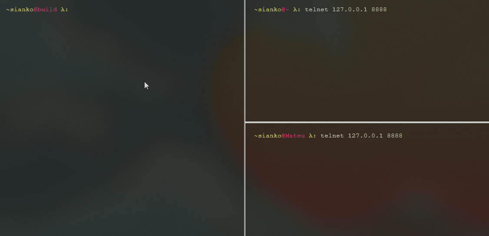

# socket-terminal - PoC project
Simple telnet server for connecting IOT devices in e.g. star topology. Build for Debian tested on WSL2. The server has already implemented few basic commands. CMake build system was used with chance to change socket platform implementation. It is possible to create users with universal commands attached to each profile. Connection works in separate threads, peers after inactivity time are disconnected automatically to free the server slots. By using virtual class, it is possible to implement own commands easily. Each command can have its own alias. Command dispatcher has build in argument parsing algorithms and enter escape system when typing commands. The project cointain also some unit tests for used parsing solutions.

# How to build & run
```bash
> mkdir build
> cd build
> cmake ..
> make all
> make run
> make run_all_ut
```

# Commands
1. __disconnect__ - kills the session.
2. __help__ - displays attached commands to the profile with desciption.
3. __verion__ - prints out the version.
4. __DebugCmd__ - prints out received and parsed arguments.

